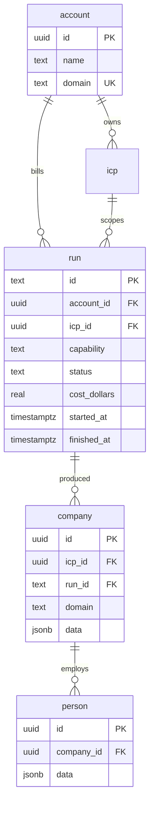
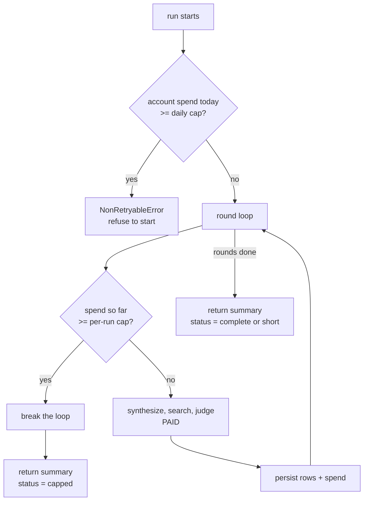

# Tenancy, Runs, Cost Safety, and Test Coverage - Plan

## Goal Capsule

**Objective.** Give the GTM engine a tenant, a first-class run record, indexes
for the queries it actually makes, a spend ceiling that stops money, paginated
reads that survive 100 companies, full capture of what the vendor returns, and
tests that would have caught this week's bugs.

**Authority order.** An R-ID wins on behaviour. A KTD wins on mechanism inside
its R constraints. A unit overrides neither.

**Prime constraint.** The pipeline works today: 10 of 10 companies in 56
seconds for $0.134, then 30 people in 127 seconds for $0.100. Every unit ends
with `bun run gate` green and that behaviour intact.

**Recovery point.** Git tag `baseline-before-multitenancy` at `a702c72`.
Database dump at `algo-backend-backups/algo-2026-08-27-baseline.sql`, holding
icp 9, company 24, person 30, evidence 297.

---

## Problem Frame

Six defects, each measured, not assumed.

1. **No tenant exists.** No column in any table names a user, account, or
   organisation. `icp.domain` is free text, unindexed and not unique. Nobody
   can ask for one customer's companies.
2. **A run is not a record.** `company.run_id` is loose text that no query
   reads. `POST /people/find` therefore scopes by `icp_id` and loads every
   company ever found for that profile, across every run, and pays the vendor
   for all of them again.
3. **No index serves a query.** All seven indexes are primary keys or unique
   constraints. `person.company_id`, the join behind every decision-maker
   read, has none and scans the table.
4. **Nothing stops spend.** No `step.do` call passes a `StepConfig`, so
   Cloudflare's default of five retries applies to every step, including the
   three that pay vendors. `CostLedger` reports cost and never acts on it.
5. **The response does not scale.** A run returns every company inline.
   Cloudflare caps a step output at 1 MiB. A full company record measures a
   median of 1,386 bytes and a p90 of 2,178, so 100 companies is 135-213 KB
   per round and roughly 600 KB across three.
6. **The tests cannot see vendors.** 182 unit tests pass while every one of
   them mocks the vendor. Four real defects shipped behind a green suite: a
   provider flag that dropped the JSON schema so the model never ran, two Exa
   fields that do not exist, an invalid enum value, and a result count that
   made the target unreachable.

A seventh defect blocks the work itself: **`drizzle-kit` cannot connect.**
`DATABASE_URL` names a database `app` that does not exist; the real tables are
in `algo`. Verified: `drizzle-kit pull` exits 1 and creates nothing.

---

## Requirements

| ID | Requirement |
|---|---|
| R1 | An `account` table exists and every `icp` belongs to one. |
| R2 | A `run` table holds one row per capability run, keyed by the runId the route already generates, carrying account, icp, capability, status, spend, and timestamps. |
| R3 | `company.run_id` is a foreign key to `run.id`. Existing rows keep their run. |
| R4 | `POST /people/find` scopes by a companies runId or an explicit domain array. It never loads a company from an earlier run. |
| R5 | `maxCompanies` leaves the HTTP contract and lives in `src/config.ts` as a spend cap. |
| R6 | Indexes exist on `person(company_id)`, `company(run_id)`, `company(icp_id, found_at desc)`, and `icp(account_id)`. |
| R7 | Every `step.do` call carries an explicit `StepConfig`. Steps that pay a vendor retry at most twice. |
| R8 | A run stops starting new paid work once its spend reaches the per-run ceiling, keeps everything it already found, and reports terminal status `capped` with the spend. |
| R9 | A run refuses to start when its account has already reached the daily ceiling. |
| R10 | A run's spend and status are persisted, so R9 is answerable across instances. |
| R11 | A workflow returns a bounded summary. Rows are read through paginated routes. |
| R12 | Everything the vendor returns for a company or a person is stored, not only the fields the pipeline reads. |
| R13 | Tests exercise real SQL, a real workflow, and the shape of every vendor request the code can emit. |
| R14 | `bun run gate` stays green, and the measured end-to-end behaviour is unchanged. |

---

## Key Technical Decisions

### KTD1. The per-run ceiling returns; it does not throw

`NonRetryableError` fails the instance immediately, and `InstanceStatus`
carries `output` and `error` as alternatives. A thrown error means `run()`
never returns, so **`output` is never set** and the partial results vanish
from the API even though the rows are safely in Postgres.

So the per-run ceiling **breaks the loop and returns normally** with
`output.status: "capped"`. Nothing throws, so retries never enter the picture.

`NonRetryableError` is correct for R9 only — the daily account cap, checked
before any work, where there is nothing partial to lose.

*(session-settled: user-directed — chosen over failing the run outright and
over warn-only: failing loses work already paid for, warn-only leaves no cap.
The mechanism is corrected here to deliver that chosen outcome.)*

### KTD2. The ceiling stops the next call, never the in-flight one

Cost is knowable only after a vendor call returns. Exa and the AI Gateway
report it in the response; Findymail reports nothing at all. A pre-call check
can only compare spend already banked against the cap.

The ceiling is therefore a **floor on when to stop**, not a hard ceiling never
crossed. Overshoot is bounded by one call, about $0.089 for a 100-result Exa
search. The plan states this rather than implying a guarantee it cannot make.

A second caveat: the Findymail rate is a $0.01 placeholder, never confirmed,
so ceiling accuracy on Findymail-heavy runs rests on a guess.

### KTD3. Read-after-write goes through the cache-disabled binding

Hyperdrive does not invalidate on write, and caching is a property of the
binding, not the query. The rule for every new query: **a read of something
this same request or run wrote goes through `HYPERDRIVE_DIRECT`.**

This matters most for the daily spend sum. Read it through the cached binding
and it under-reports, and the cap is silently passable.

### KTD4. Switch from `push` to `generate` plus `migrate`

Adding a non-null foreign key to a populated table needs three ordered steps:
add nullable, backfill, then constrain. `push` can do the first and third and
has no way to express the second, and it offers a truncate prompt whose wrong
answer destroys the table. `--force` accepts that prompt unread.

Versioned migration files can interleave the backfill. Because there is no
migration history, this needs a baseline first: `drizzle-kit pull --init`
records the current four tables as an already-applied migration 0000.

*(session-settled: user-directed — the account and run tables were chosen over
leaving `company.run_id` as loose text, which cannot scope a people run.)*

### KTD5. Rows are read from routes, not returned by the workflow

The rows are already in Postgres. Returning them again through the step output
duplicates them and walks toward the 1 MiB cap. The workflow returns a
summary; `GET /runs/{runId}/companies` and `GET /runs/{runId}/people` read the
rows with a limit and a cursor.

### KTD6. Full vendor capture reuses the existing jsonb columns

`company.data` and `person.data` are already `jsonb`. Today they keep four
cherry-picked fields and discard the description, founded year, web traffic,
financials, city, country, and workforce that we already paid for.

No new column. The shape becomes `{ provider, entity, result }` — the vendor's
own object stored verbatim under `entity`, keyed by `provider` so a second
vendor sits beside it. `evidence` is unchanged: it stays the asserted-fact
table, append-only; `data` is the raw capture.

### KTD7. The vendor guard is a schema-conformance test, not a live call

Exa accepts an unknown category and an invalid `type`, ignores both, bills
$0.007, and reports no error. There is no free contract check, and a test
cannot assert that the vendor rejects a bad field, because it does not.

The gate instead asserts that **our own request builder never emits a field
outside the measured Exa schema**. That is free, runs every gate, and would
have caught `includeText`, `excludeText`, and `type: "neural"` immediately.
Live vendor calls move to a separate opt-in command.

---

## High-Level Technical Design

Data model after the change:

Where the spend ceiling sits relative to the paid call:

The check sits before the paid call, so a run that is already over stops
without spending again. It cannot shrink the call in flight — see KTD2.

---

## Implementation Units

### U1. Point the migration tool at the real database

**Goal.** `drizzle-kit` connects to the database the Worker actually uses.

**Requirements.** Prerequisite for R1, R2, R3, R6.

**Dependencies.** None. Nothing else can start.

**Files.** `.env`, `docs/solutions/migration-tooling-target.md`.

**Approach.**
1. Set `DATABASE_URL` to the database the runtime uses, so it matches the
   `localConnectionString` in `wrangler.jsonc`.
2. Confirm by connecting and listing the four expected tables.

**Test scenarios.**
- `drizzle-kit pull` exits zero against the configured URL.
- Listing tables through `DATABASE_URL` shows `icp`, `company`, `person`, and
  `evidence`. An empty result means the wrong database and is a stop.

**Verification.** `drizzle-kit` reports the existing four tables rather than
exiting 1.

### U2. Baseline the schema as migration 0000

**Goal.** A migration history that matches what is already deployed.

**Requirements.** Prerequisite for R1, R2, R3, R6.

**Dependencies.** U1.

**Files.** `drizzle/` (new), `package.json`.

**Approach.**
1. Run `drizzle-kit pull --init` to record the current four tables as an
   applied migration 0000.
2. Add a `db:migrate` script beside the existing `db:generate`.
3. Confirm a fresh `generate` produces an empty diff, proving the baseline
   matches the live schema.

**Execution note.** Verify the empty diff before writing any new table. A
non-empty diff here means the baseline is wrong and every later migration
inherits the error.

**Test scenarios.** `Test expectation: none -- tooling baseline, no behaviour changes.`

**Verification.** `drizzle/0000_*.sql` exists, and a fresh `generate` adds
nothing.

### U3. Split `people.ts` and `companies.ts` under the size limits

**Goal.** Room to add code without tripping the file-length rule.

**Requirements.** Prerequisite for R4, R8, R12.

**Dependencies.** None.

**Files.** `src/core/people.ts`, `src/core/companies.ts`, plus the new modules
the split creates.

**Approach.** Biome counts non-blank lines against a 400 limit.
`people.ts` sits at 377 with 23 free; `companies.ts` at 367 with 33 free.
Both receive new code in later units, so both are split first along the seam
each file already shows: the provider-shaped mapping and filtering helpers
move out, and the orchestration stays.

**Execution note.** Pure move, no behaviour change. The existing tests must
pass untouched apart from import paths — that is the proof the split was
faithful.

**Test scenarios.**
- The existing `companies.spec.ts` and `people.spec.ts` suites pass with no
  assertion changed.
- Every moved symbol is imported through `@/`, never a relative path.

**Verification.** Gate green, every touched file under the limit with room to
spare.

### U4. Add the account and run tables and the indexes

**Goal.** The tenancy and run schema exists, with the four missing indexes.

**Requirements.** R1, R2, R6. R3 is deliberately deferred to U5.

**Dependencies.** U2.

**Files.** `src/core/db/schema.ts`, `drizzle/0001_*.sql`, `test/db.spec.ts`.

**Approach.**
1. Add `account`, and `run` keyed by a text primary key, since the runId is
   the string the route already builds.
2. Add `icp.account_id` **nullable** for now, and the four indexes.
3. Everything in this unit is additive, so no truncate prompt can appear.

**Technical design.** Directional: the composite index follows the idiom
already in `schema.ts` for `evidence_subject_kind_seen_idx` — column list with
per-column ordering, `found_at` descending. A `text` primary key carries no
generated default, so the application always supplies `run.id`.

**Patterns to follow.** `evidence_subject_kind_seen_idx` in
`src/core/db/schema.ts`; the structural connection interfaces in
`src/core/db/queries.ts`.

**Test scenarios.**
- Inserting a `run` row with an explicit text id round-trips through real SQL.
- Inserting a `run` without an id fails, proving there is no default.
- A company insert still succeeds while `icp.account_id` is null, proving the
  additive step did not break the working path.
- The four indexes exist, read back from `pg_indexes` by name.

**Verification.** Migration applies to the live database, the four baseline row
counts are unchanged, gate green.

### U5. Backfill tenancy and the run history, then constrain

**Goal.** Existing data gets an account and a run, and the constraints land.

**Requirements.** R1, R2, R3.

**Dependencies.** U4.

**Files.** `drizzle/0002_*.sql`, `src/core/db/schema.ts`, `test/db.spec.ts`.

**Approach.**
1. Insert one account and point all 9 `icp` rows at it, then set
   `icp.account_id` not null.
2. Derive a `run` row for each of the 6 distinct `company.run_id` values. All
   24 company rows carry one, none is null, and each string already encodes
   capability, icp id, and date.
3. Add the `company.run_id` foreign key **after** step 2. Adding it first fails
   against the existing rows.

**Execution note.** This is the only unit that can lose data. Take a fresh dump
first. Never run `push --force`. Backfill is hand-written SQL inside the
migration, which is the whole reason for KTD4.

**Test scenarios.**
- After migration, no `icp` row has a null `account_id`.
- Each of the 6 distinct run ids has exactly one `run` row.
- Every one of the 24 company rows resolves to a real run through the foreign
  key.
- Inserting a company with an unknown `run_id` is rejected.
- The four baseline row counts are unchanged: 9, 24, 30, 297.

**Verification.** Baseline counts hold, constraints present, gate green.

### U6. Persist the run record and its spend

**Goal.** Every run writes its own row, so spend is queryable per account.

**Requirements.** R2, R10.

**Dependencies.** U5.

**Files.** `src/core/db/queries.ts`, `src/workflows/find-companies.ts`,
`src/workflows/find-people.ts`, `src/workflows/enrich.ts`, `test/db.spec.ts`.

**Approach.**
1. Add query functions to open a run, close it with a status and spend, and
   sum an account's spend for the day.
2. Each workflow opens its run first and closes it last.
3. Per KTD3, the daily sum reads through `HYPERDRIVE_DIRECT`.

**Patterns to follow.** The `DbFactory` seam and the structural connection
interfaces in `src/core/db/queries.ts`; `recentDomains` for a direct-binding
read.

**Test scenarios.**
- Opening a run writes a row with the runId as its primary key.
- Closing a run records terminal status and spend.
- The daily sum counts only the named account and only today.
- The daily sum requests the direct binding, asserted the way `db.spec.ts`
  already asserts binding mode.
- A second run for the same account adds to the day's total.

**Verification.** A real end-to-end run leaves one run row with a spend
matching the reported cost, gate green.

### U7. Enforce the spend ceilings

**Goal.** Money stops. Work already paid for survives.

**Requirements.** R8, R9, R14.

**Dependencies.** U6.

**Files.** `src/config.ts`, `src/core/companies.ts`, `src/core/people.ts`,
`src/workflows/find-companies.ts`, `src/workflows/find-people.ts`,
`test/companies.spec.ts`, `test/people.spec.ts`.

**Approach.**
1. Add `perRunDollars: 2.00` and `perAccountDailyDollars: 50.00` to
   `src/config.ts`.
2. Before each round or batch, compare banked spend against the per-run
   ceiling. Over it, break and return with status `capped` (KTD1).
3. At workflow start, compare the account's day against the daily ceiling.
   Over it, throw `NonRetryableError` before any paid work.

**Execution note.** Write the cap tests first. A ceiling that never fires is
indistinguishable from no ceiling, and only a test that drives spend past the
line tells them apart.

**Test scenarios.**
- A scripted ledger past the per-run ceiling stops the next round.
- A capped run returns the companies it already found, never an empty result.
- A capped run reports status `capped`, not `complete` or `short`.
- A capped run reports the spend it reached.
- A run under the ceiling is untouched and still reports `complete`.
- An account already over the daily ceiling refuses to start and performs no
  vendor call.
- Overshoot is bounded: a round that begins under the ceiling is allowed to
  finish, and the recorded spend may exceed the cap by that one round (KTD2).

**Verification.** Cap tests pass, an ordinary run is unaffected, gate green.

### U8. Configure every step and cut retries on paid work

**Goal.** No step silently retries a paid vendor call five times.

**Requirements.** R7.

**Dependencies.** None.

**Files.** `src/config.ts`, `src/workflows/find-companies.ts`,
`src/workflows/find-people.ts`, `src/workflows/enrich.ts`.

**Approach.** Nine `step.do` sites carry no config today, so all inherit five
retries with exponential backoff and a ten-minute timeout. Three pay vendors —
`round_N`, `people-batch-N`, `enrich-batch-N` — and take a retry limit of two.
The six database-only steps keep a more forgiving budget, because a transient
database blip is worth retrying and costs nothing.

**Test scenarios.**
- Every `step.do` call site passes a config; none relies on the default.
- The three paid steps use the paid budget; the six database steps use the
  cheap one.

**Verification.** No call site is left on the default, gate green.

### U9. Store what the vendor returned

**Goal.** Stop discarding data already paid for.

**Requirements.** R12.

**Dependencies.** U3.

**Files.** `src/core/companies.ts`, `src/core/people.ts`,
`src/workflows/find-companies.ts`, `src/workflows/find-people.ts`,
`test/companies.spec.ts`, `test/people.spec.ts`.

**Approach.** Per KTD6, `company.data` and `person.data` take
`{ provider, entity, result }`, with the vendor's object stored verbatim.
No column is added. `evidence` is untouched.

**Test scenarios.**
- A saved company carries the full entity, including fields the pipeline never
  reads, such as web traffic and founded year.
- A company whose record omits optional fields still saves, with those keys
  simply absent.
- `evidence` rows are unchanged in count and shape by this unit.
- The stored blob names its provider.

**Verification.** A real run stores descriptions and financials that the
previous run discarded, gate green.

### U10. Rescope the people API to a run or a domain list

**Goal.** A people run never pays for a company from an earlier run.

**Requirements.** R4, R5.

**Dependencies.** U5.

**Files.** `src/routes.ts`, `src/workflows/find-people.ts`,
`src/core/people.ts`, `test/routes.spec.ts`, `test/people.spec.ts`.

**Approach.**
1. `POST /people/find` accepts a companies `runId` or an explicit `domains`
   array, and no longer accepts `icpId`.
2. Company loading filters by `run_id`, replacing the `icp_id` filter that
   pulls every historical row.
3. `maxCompanies` leaves the request body and becomes a config cap (R5).
4. A domain array normalises through the existing `normalizeDomain`, never a
   new normaliser.

**Test scenarios.**
- A run id loads only that run's companies, proven with two runs on one profile
  where the older run's companies are absent.
- A domain array loads exactly those companies.
- A request carrying neither is rejected with 400.
- A request carrying both is rejected, rather than one silently winning.
- Domains differing only by `www.` or case resolve to the same company.
- An unknown run id yields an empty set, not every company for the profile.
- A domain naming no known company is reported, not silently dropped.
- `maxCompanies` in the body is no longer accepted.

**Verification.** A second people run against an older run id searches only
that run's companies, gate green.

### U11. Return a summary, read rows through paginated routes

**Goal.** A 100-company run cannot approach the step output cap.

**Requirements.** R11.

**Dependencies.** U6, U10.

**Files.** `src/routes.ts`, `src/core/db/queries.ts`,
`src/workflows/find-companies.ts`, `src/workflows/find-people.ts`,
`test/routes.spec.ts`, `test/db.spec.ts`.

**Approach.**
1. Workflow output keeps counts, status, spend, search plans, and rejects, and
   drops the row arrays (KTD5).
2. Add `GET /runs/{runId}/companies` and `GET /runs/{runId}/people`, both with
   a limit and a cursor, both bearer-protected like every other route.
3. Ordering is stable, so a cursor cannot skip or repeat a row.

**Test scenarios.**
- A run of 100 companies returns a summary whose size does not grow with the
  count.
- The companies route returns a first page and a cursor.
- Following the cursor returns the remainder with no duplicate and no gap.
- A limit beyond the maximum is clamped rather than honoured.
- An unknown run id returns 404, not an empty 200.
- The routes reject a request with no bearer token.
- The people route returns people for that run's companies only.

**Verification.** A 100-company run completes and its rows are readable page by
page, gate green.

### U12. Test what the mocks could not see

**Goal.** The defects that shipped this week would now fail the gate.

**Requirements.** R13.

**Dependencies.** U8, U11.

**Files.** `test/exa-request-contract.spec.ts` (new),
`test/model.spec.ts` (new), `test/find-companies.workflow.spec.ts` (new),
`test/find-people.workflow.spec.ts` (new), `package.json`.

**Approach.**
1. **Request-shape conformance (KTD7).** Assert the search request builder
   emits no field outside the measured Exa schema, and only valid enum values.
   Free, and catches the whole class.
2. **Model layer.** Cover `src/core/model.ts`, which is untested and held two
   of the four defects. Assert the request body actually carries the JSON
   schema and the routing flag.
3. **Workflow level.** Drive the real entrypoints. The route tests already
   prove this works, given immediate termination and `fileParallelism: false`.
4. **Real SQL.** Integration tests use the live local database, proven
   possible and recorded in `docs/solutions/real-sql-in-workers-tests.md`.
5. Live vendor calls go in a separate opt-in script, never the gate, because
   each costs about $0.007.

**Execution note.** Write each test so it fails against the pre-fix code. A
regression test that passes on the broken version proves nothing.

**Test scenarios.**
- A request carrying `includeText` fails the conformance test.
- `type: "neural"` fails the conformance test; `auto` passes.
- A model call omitting the JSON schema fails, catching the
  `supportsStructuredOutputs` default.
- A model call omitting the routing flag fails.
- The companies workflow reaches `complete` on a scripted happy path.
- The companies workflow reaches `capped` when spend crosses the ceiling, and
  still returns rows.
- The people workflow loads only its run's companies.
- A workflow step that throws a retryable error is retried no more than the
  configured limit.
- Real SQL proves `person(company_id)` is used rather than scanned.
- Every test cleans up its rows, since the database is shared.
- No test uses `vi.mock`, which a Biome plugin bans.

**Verification.** Each new test fails against `baseline-before-multitenancy`
and passes after, gate green.

---

## Verification Contract

Every unit ends with `bun run gate` green — six checks, no subset counts.

The end-to-end proof, run after U12: find 10 companies from a prompt, then find
their decision makers, and compare against the recorded baseline of 10 of 10 in
56 seconds for $0.134 and 30 people in 127 seconds for $0.100. A materially
worse count, a materially higher cost, or a status other than `complete` is a
regression, not a new normal.

Database safety is checked at U4 and U5 by comparing row counts against the
recorded baseline of 9, 24, 30, and 297.

---

## Definition of Done

1. R1 through R14 hold.
2. Gate green on every unit, three consecutive runs at the end.
3. Baseline row counts unchanged, or changed only by rows a test created and
   removed.
4. The end-to-end run matches or beats the recorded baseline.
5. Each new regression test demonstrably fails against the baseline tag.
6. No `push --force` was ever run.

---

## Risks and Dependencies

| Risk | Severity | Mitigation |
|---|---|---|
| A truncate prompt answered wrongly during U5 destroys a table | Highest | Versioned migrations rather than `push` (KTD4); a fresh dump before U5; `--force` never used |
| The migration tool silently targets an empty database | High | U1 confirms the four tables through `DATABASE_URL` before any migration; a clean diff against an empty database looks identical to a correct one |
| The daily spend sum reads a stale cached value and the cap is passable | High | KTD3 routes it through `HYPERDRIVE_DIRECT`, asserted by test |
| A capped run returns nothing and loses paid work | High | KTD1 returns rather than throws; a test asserts rows come back with status `capped` |
| Splitting two large files changes behaviour | Medium | U3 is a pure move, proven by existing tests passing with no assertion changed |
| Shared test database causes cross-test interference | Medium | `fileParallelism` is already false; every writing test scopes and removes its own rows |
| The Findymail rate is an unverified $0.01 placeholder | Low | Recorded in the plan; ceiling accuracy on Findymail-heavy runs is approximate until probed |

---

## Scope Boundaries

**In scope.** R1 through R14.

### Deferred to Follow-Up Work

- Probing Exa's `category: "people"` for structured person records. It would
  likely remove the LLM extraction from the people path and fix the name
  collisions seen in the last run, where a third of 30 people matched a
  different company of the same name at confidence 0.4. Not probed, and it is a
  separate change to the people pipeline.
- Filtering or suppressing people below an employment-confidence threshold. The
  signal exists and is recorded; nothing acts on it yet.
- Authentication that maps a bearer token to an account. This plan creates the
  tenant; it does not change who may call the API.

### Not in Scope

- The daily end-to-end orchestration workflow.
- Campaign push.
- Provisioning PlanetScale and Hyperdrive for production.

---

## Assumptions

- One account covers all existing data. The 9 icp rows belong to one customer,
  so U5 creates a single account rather than inferring several.
- The runId format `capability_icpId_date` is stable enough for U5 to derive
  run rows from the 6 existing values. Verified: all 24 company rows carry a
  non-null id in that shape.
- `$2.00` per run and `$50.00` per account per day are starting values in
  config, chosen against a measured $0.234 per full job. They are meant to be
  tuned, not defended.
- The plan targets the local Postgres. Production migration through PlanetScale
  is the same sequence against a different URL, and confirming that URL uses
  the direct port rather than the pooled one is a check for that day.

---

## Sources and Research

- `docs/solutions/exa-search-contract.md` — the measured Exa request schema,
  the entity fill rates, and the finding that no contract check is free.
- `docs/solutions/real-sql-in-workers-tests.md` — real SQL from the Workers
  test runtime, measured.
- `docs/solutions/migration-tooling-target.md` — the database mismatch.
- `docs/solutions/dedupe-read-cache-consistency.md` — the two Hyperdrive
  bindings and why a read after a write needs the direct one.
- `docs/solutions/cost-ledger-open-rates.md` — cost is known only after a call.
- `docs/solutions/workerd-outbound-fetch.md` — driving a real workflow in tests.
- Cloudflare Workflows: step retry defaults, the 1 MiB step output cap, and
  `InstanceStatus` carrying `output` and `error` as alternatives.
- Drizzle: `push` truncate prompts, and `pull --init` to baseline a schema with
  no migration history.
