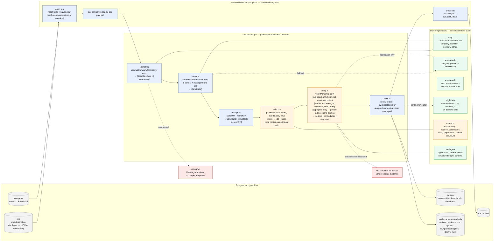
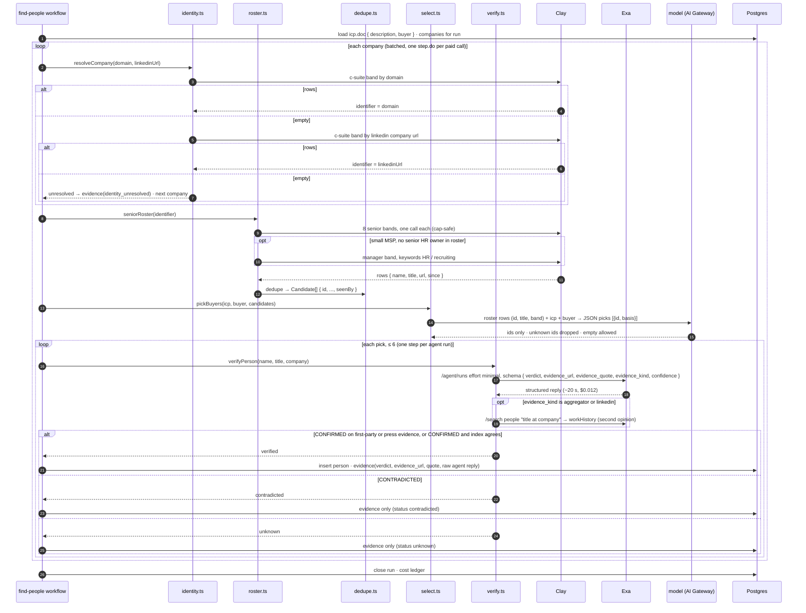

# Find people — internal architecture

Two diagrams. The first is the structure: which module does what, what data moves between
them, and where the code/model boundary sits. The second is the run: how one company moves
through Workflow steps, where each paid call lives, and where a run stops.

## 1 · Structure — modules, data, and the code / model boundary

**The boundary, drawn:** blue is code and decides what is *true* about a record — identity,
fields, dedupe, currency. Orange is the model and decides what a record *means* — is this a
buyer, does this page confirm the claim. The model never returns free text that code parses:
it returns candidate ids, or one label from a closed set. Green is a vendor call; each one
sits in its own Workflow step so a retry never repeats a paid call.

## 2 · Run — one company through the steps

## 3 · The contracts between stages

| from → to | shape | who guarantees it |
|---|---|---|
| workflow → identity | `{ domain, linkedinUrl }` | company row |
| identity → roster | `{ identifier, how: "domain" \| "linkedin" }` or `unresolved` | code; Clay's empty array on a wrong domain |
| roster → dedupe | `Candidate { name, title, company, url, since, src }[]` | Clay row mapper |
| dedupe → select | `Candidate { id, ..., seenBy[] }[]` with stable ids | `canonUrl` then `nameKey` |
| select → verify | `Pick { id, basis }[]` ≤ 6, ids resolved to records by code | Zod on the model reply; unknown ids counted and dropped |
| verify → persist | `{ status, verdict, evidence_url, evidence_quote, evidence_kind, confidence }` with `status ∈ verified \| contradicted \| unknown` | the agent's closed-set reply; aggregator-only needs the index to agree; the quote must be on the page |
| persist → DB | `person` row only when `verified`; `evidence` rows always | append-only invariant |

## 4 · What is deliberately not in the default path

- **Apollo** — surnames obfuscated, never resolved to a person another source confirmed.
- **Exa agent for retrieval** — $0.225 for four people already in the roster. It is the verifier, not a retriever.
- **Any second round or planner** — recovered nothing at all seven companies where it fired.
- **BrightData rosters** — paid per row, a third of rows unusable, hangs under load.
- **String matching for meaning** — no regex decides a buyer, no word overlap confirms a page.
