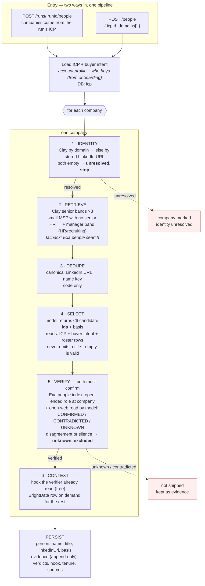

# Find people — end to end

## Providers, one line each

| provider | used for | not used for |
|---|---|---|
| Clay | identity + full senior roster with real titles (quota, ~free) | — |
| Exa /search people | verification (structured employment) · retrieval fallback | primary retrieval |
| Exa /search web + model | verification (open web) · the free outreach hook | — |
| BrightData | on-demand posts for buyers with a weak hook | rosters (paid per row, hangs under load) |
| Apollo | — | anything by default (obfuscated surnames never resolve) |
| Exa agent | — | people (7× cost, zero yield) |

## What the two entry points share

Both resolve to `(icp, buyerIntent, companies[])` and then run the same per-company pipeline
above. The run-ID route reads companies from the run; the domains route builds them from the
list. Nothing below "for each company" knows which door it came through.
